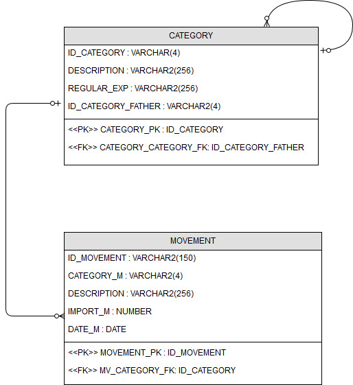

# Checkount

Checkount is a simple console application where you can see your totalizations of bank's movements by categories.
The categories are by default in the database.

This application uses:

- Hibernate 5.2.9.Final
- Java SE 1.8.0_121
- ojdbc7-12.1.0.2
- log4j-core-2.8.1

To try this application it is necessary to have installed:

- Oracle Database 12c Standard Edition Release 12.1.0.2.0

###1. Categories

There are different categories in this application where you can distribute the movements. These categories are:

	CATEGORY 
		INPUT
			PAYROLL
		EXPENSE
			FIXED
				HOME
					WATER
					RENT
					GAS
					LIGHT
					TELEPHONE
				FOOD
			GENERAL
				FANCY
				SHOPPING
				LEISURE
				ANOTHER
				HEALTH
				TRAVEL
		SAVING

The "CATEGORY" is the main. 

###2. Database

The database diagram is:

In the "database" folder in this project, you can get the scripts to install the database. This folder contains the following:

- One folder that contains the scripts to create the tables and foreign key [(CREATE.sql)](database/scripts/CREATE.sql), the script to clean the movements' table [(CLEAN.sql)](database/scripts/CLEAN.sql) and the script to delete the tables[(DELETE.sql)](database/scripts/DELETE.sql) from the database.

- In the other folder you can find the script [DATA_CATEGORY_DEFAULT.sql](database/data/DATA_CATEGORY_DEFAULT.sql). It inserts in the table CATEGORY the different relations between the description of movements and the category. For example if the movement has as description "OP.TARJ- GAMES" this movement will be in the "SHOPPING" category, because the table "CATEGORY" will have a row where in their column "REGULAR_EXP" will have one string with the regular expression ".*GAMES.*".

###3. Main menu

This application has 4 options:
 
- Option 0. "Exit program." -> With this option you can close the program.

- Option 1. "Load movements in database." -> This option reads the movements from a file (The file has be to .cvs) and insert each movement into the database.

- Option 2. "Get totalizations by date." -> Through this option you can get the totalizations between two dates. For example between 01.01.16-31.01.16. And the result for this example will be:

								CATEGORY >> 317.73
									INPUT >> 1138.65
										PAYROLL >> 1138.65
									EXPENSE >> -820.92
										FIXED >> -606.05
											HOME >> -542.89
												WATER >> --
												RENT >> -500.0
												GAS >> --
												LIGHT >> -35.89
												TELEPHONE >> -7.0
											FOOD >> -63.16
										GENERAL >> -214.87
											FANCY >> -9.99
											SHOPPING >> -1.49
											LEISURE >> --
											ANOTHER >> --
											HEALTH >> -130.99
											TRAVEL >> -72.4
									SAVING >> --

			In this example we can see than the inputs like inputs about payroll and saving is more greater than expenses. So, 
			"CATEGORY" indicates than during the time between 01.01.16 and 31.01.16 we have 317.73 more.

- Option 3. "Delete all movements from database." -> This option deletes all movements from database.

# Licence

This project is licensed under the terms of the GNU General Public License v3.0.

